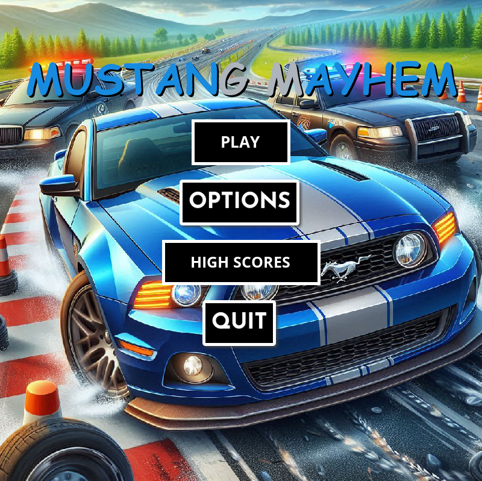
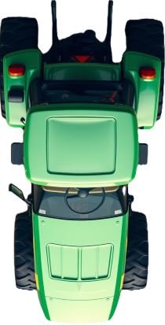

# 🏎️ Mustang Mayhem

A thrilling car racing game where you control a Mustang and dodge various vehicles while trying to achieve the highest score possible!

## 🎮 How to Play

- Use arrow keys to steer your Mustang
- Avoid other vehicles and stay on the road
- Do not go off the road or you will lose!
- The game speeds up as your level increases
- Press Space to pause the game
- Try to stay alive as long as possible to achieve the highest score!git add

## 🚗 Vehicles

### Player Car

### Enemy Vehicles

## 🎵 Sound Effects

- Engine sounds
- Crash effects
- Button clicks
- Background music
- Vehicle passing sounds

## 🔧 Features

- Dynamic difficulty scaling
- High score system
- Sound toggles
- Pause menu
- Collision detection
- Visual effects

## 📥 Download

[Download game_exe folder](game_exe)

### System Requirements

- Windows 10 or later
- 2GB RAM
- 500MB free disk space

### Installation

1. Download the entire `game_exe` folder
2. Keep all files in the same directory - do not move or separate files
3. Run `Mustang_Mayhem.exe` from the folder

> ⚠️ **Important**: All files in the `game_exe` folder must remain together for the game to work properly. The executable needs access to the images and sounds folders.

## 🙏 Credits

### Sound Effects

- All sound effects courtesy of [Freesound](https://freesound.org/)

### Button Assets

- UI buttons created using [Da Button Factory](https://dabuttonfactory.com/)

### Images

- Vehicle and scenery images generated with [Cursor AI](https://cursor.sh/)
- Additional assistance from [GitHub Copilot](https://github.com/features/copilot)
- Background images from [Free Images](https://www.freeimages.com/)

## 🎯 Future Updates

- Additional vehicles
- New game modes
- More sound effects
- Visual improvements
- Achievements system
